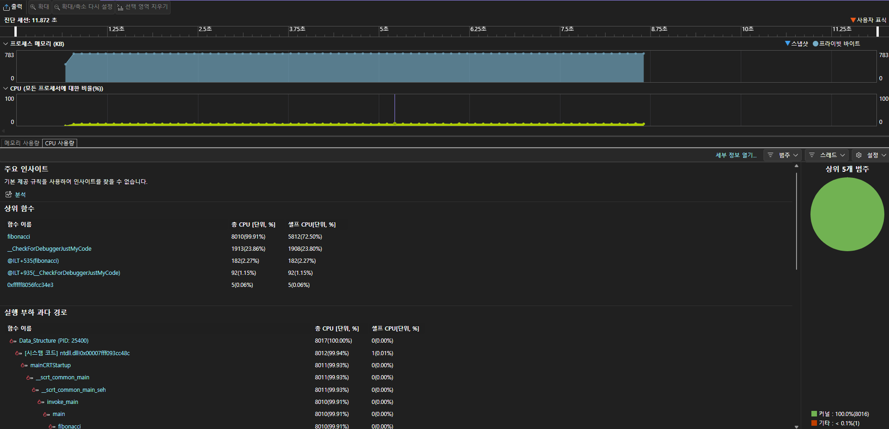
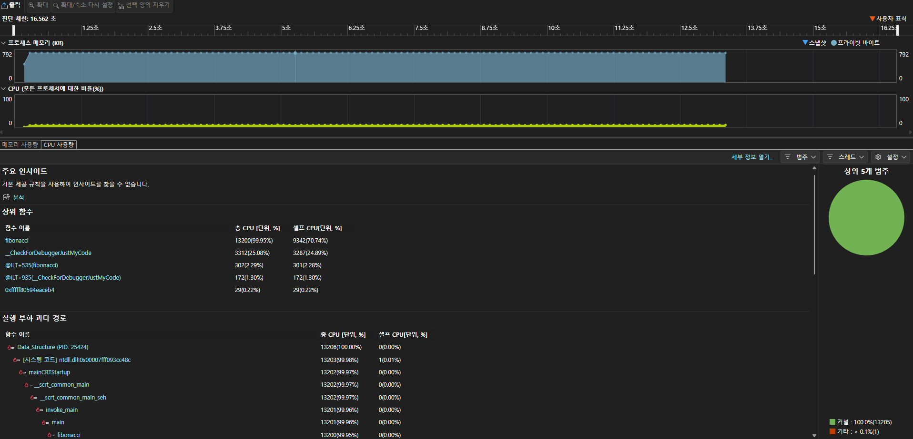
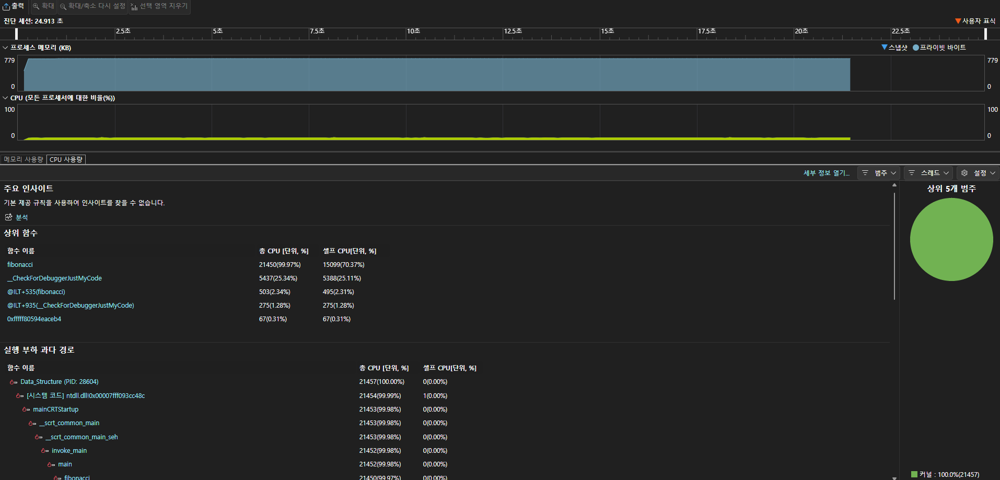

- GCD 시간복잡도 검증  
해당 과제에서 이웃한 피보나치 수끼리 GCD를 구하라고 되어 있으나,  
이웃한 피보나치 수는 항상 서로소이므로 GCD(F(n), F(n-1)) = 1이다.  
따라서 GCD 시간복잡도 검증은 어렵다.  

- 피보나치 수열의 시간복잡도 검증  
재귀적 방법으로 구하는 피보나치 함수는 각 호출에서 두 개의 하위 호출이 발생한다.  
따라서 이 함수의 시간복잡도는 2^n으로 예상된다.  
실험 결과 n = 42, 43, 44에 대해 각각 3회 측정 후 평균값을 구했고, 소수점 없이 초 단위로 정리했다.  
측정한 시간은 n = 5부터 해당 n까지 누적 시간이며, 단일 n의 실행 시간을 구하기 위해 이전 n까지 누적 시간을 빼서 계산했다.  
n = 42 -> 누적시간 : 약 12초  
n = 43 -> 누적시간 : 약 16초 / 단일시간 : 약 4초  
n = 44 -> 누적시간 : 약 24초 / 단일시간 : 약 8초  
단일 시간 증가를 보면 n이 1 증가할 때마다 실행 시간이 2배 증가함을 확인할 수 있다.  
따라서 피보나치 수열의 시간복잡도는 O(2^n)으로 판단된다.  

- 해당 과제의 코드  
#include <stdio.h>  
#include <stdlib.h>  
#include "../A3_2/my_math.h"   

long long fibonacci(int n) {  
    if (n <= 1)  
        return n;  
    return fibonacci(n - 1) + fibonacci(n - 2);  
}  

int main() {  
    int n;  

    for (n = 5; n <= 44; n++) { // 최대 n 값을 바꿔가며 측정  
        long long fn = fibonacci(n);  
        long long fn_1 = fibonacci(n - 1);  
        long long g = gcd(fn, fn_1);  

        printf("n = %d, F(n) = %lld, F(n-1) = %lld, GCD = %lld\n", n, fn, fn_1, g);  
    }  

    return 0;  
}  

- Big-O 계산식  
T(n) = T(n-1) + T(n-2) + O(1) -> O(2^n)  
여기서 O(1)은 덧셈 연산을 나타낸다.  

- 프로파일링한 그래프  

