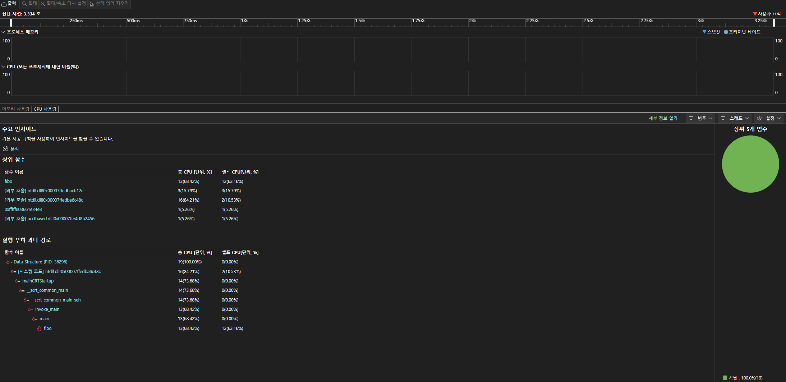
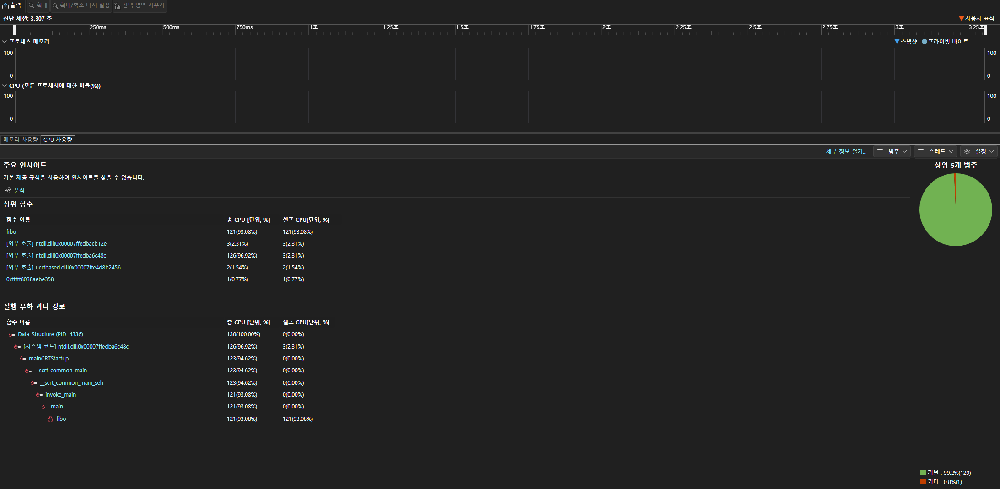
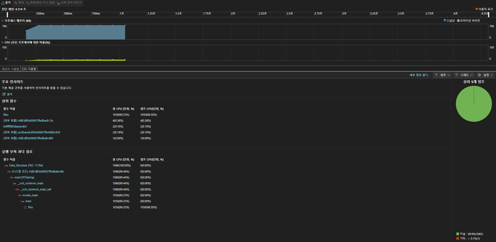
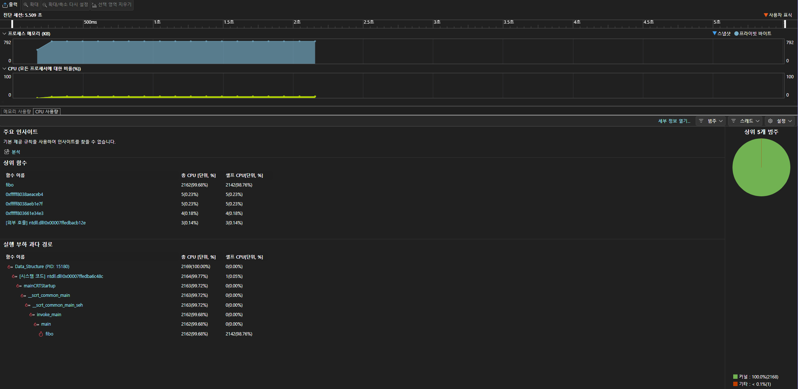
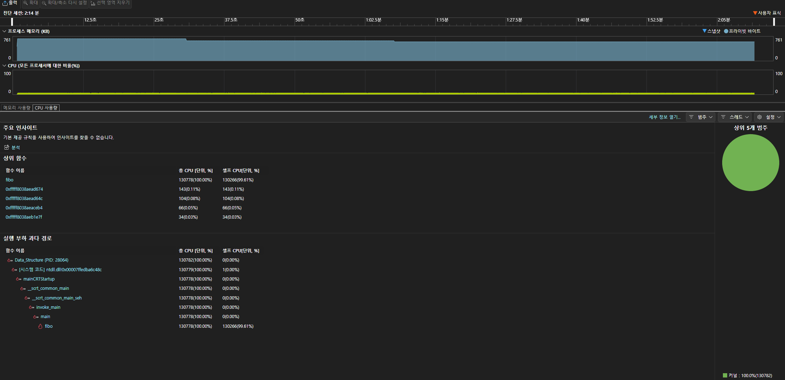
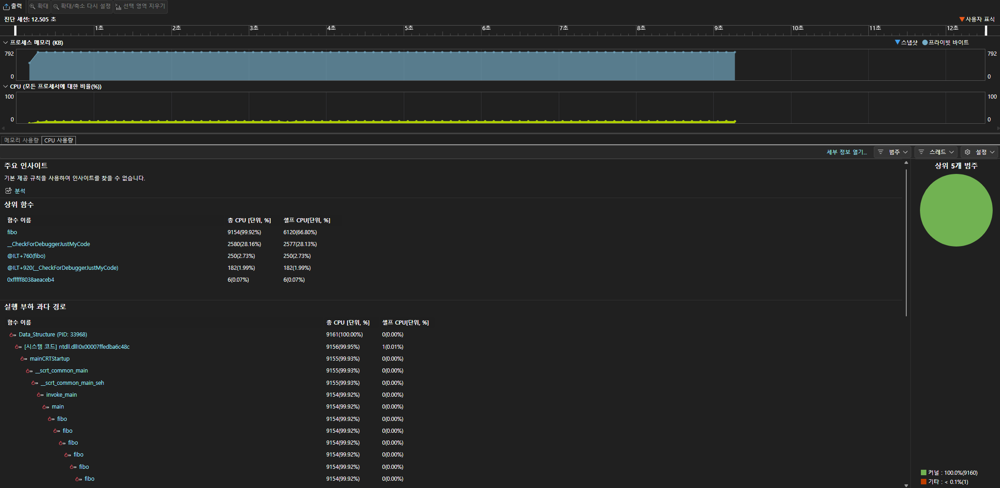
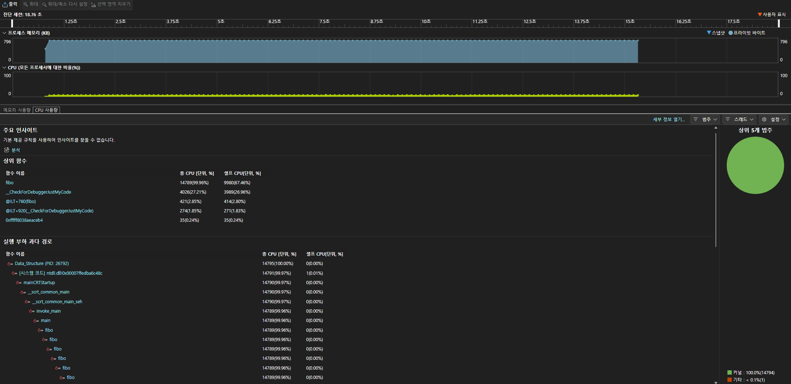
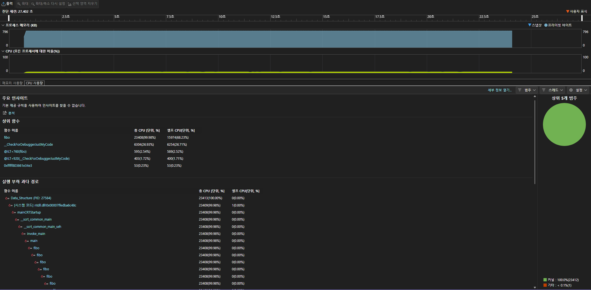
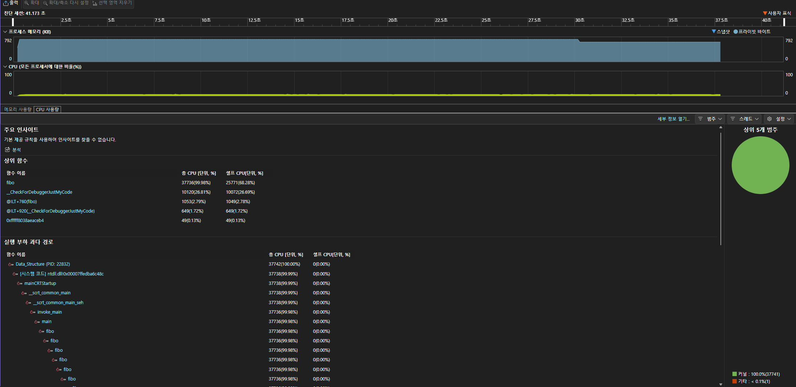

- 순환적 방법  
순환적 방법은 시간 복잡도가 이론상으로 O(n)이다. 하지만 실제는 제대로 측정이 되지 않았다.  
수행 시간 프로파일링은 N = 천만, 1억, 10억, 20억, 30억에 대해 각각 3회 측정 후 평균값을 구했다.  
N = 천만 ->  약 3.3초  
N = 1억  ->  약 3.3초  
N = 10억 ->  약 4.3초  
N = 20억 ->  약 5.5초  
N = 30억 ->  2분 이상  
N이 1억보다 작을 때는 실행 시간이 유의미한 변화가 없었으나 10억과 20억에서 실행 시간이 증가하며 변화가 생겼다.  
하지만 30억을 하는 순간 실행 시간이 2분이 넘어가며 측정에 신뢰성을 잃었다.

N = 천만일때  
  

N = 1억일때  
  

N = 10억일때  
  

N = 20억일때  
  

N = 30억일때  
  

- 재귀적 방법  
재귀적 방법은 시간 복잡도가 이론상으로 O(2^n)이다. 하지만 실제는 O(φ^n)이다.
수행 시간 프로파일링은 N = 46, 47, 48, 49에 대해 각각 3회 측정 후 평균값을 구했고, 소수점 없이 초 단위로 정리했다.  
N = 46 ->  약 12초  
N = 47 ->  약 18초  
N = 48 ->  약 27초  
N = 49 ->  약 41초  
N이 1 증가할 때마다 실행 시간이 약 1.5배 증가함을 확인할 수 있으며 이는 O(φ^n)에 가깝다고 볼 수 있다. 

N=46일때  
  

N=47일때  
  

N=48일때  
  

N=49일때  
  

- 순환적 방법과 재귀적 방법의 비교  
순환적 방법은 실험 결과 10억, 20억을 해도 실행 시간이 매우 짧다는 것을 알 수 있다.  
하지만 재귀적 방법은 N이 49만 되어도 약 41초로 엄청 느린 것을 알 수 있다.